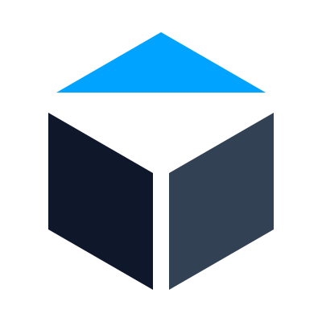
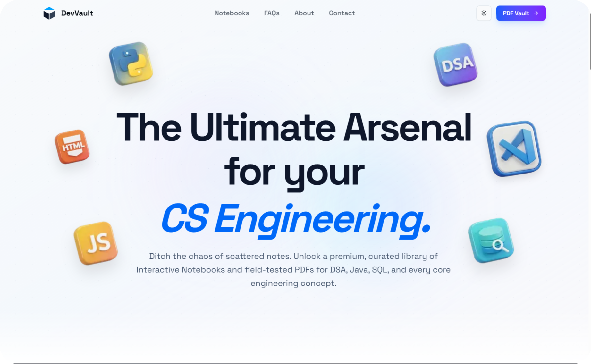
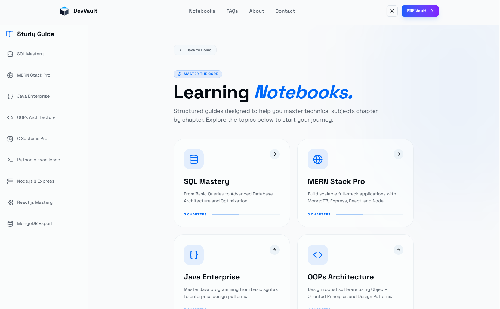
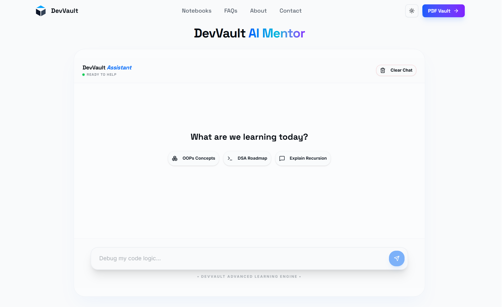
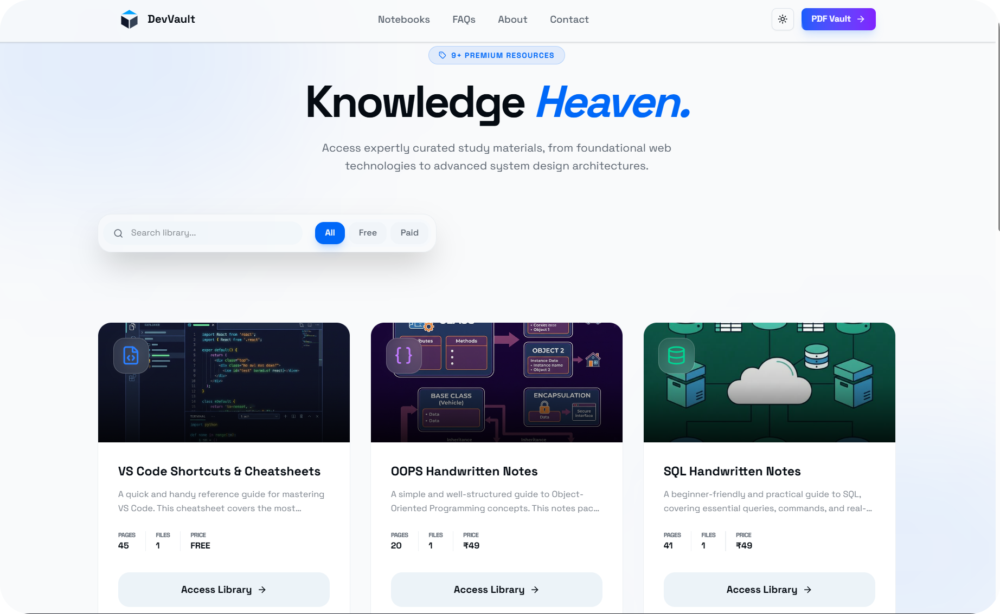

#  DevVault

    

**DevVault** is a premium, high-performance resource hub designed for Computer Science students and engineering professionals. It provides a curated library of interactive notebooks, field-tested PDFs, and an AI-powered study assistant to bridge the gap between academic theory and industry practice.

---

## 📸 Project Showcase

<p align="center">
  
</p>

<p align="center">
   
</p>

<p align="center">
  
</p>

---

## ✨ Key Features

- **🎯 Mastery Guides**: Beyond static PDFs—interactive notebooks for DSA, OOPS, DBMS, and more.
- **🛡️ Secure Digital Vault**: Industry-standard asset protection with JWT-secured download links.
- **💳 Payment Integration**: Fully functional Razorpay checkout flow for premium resources.
- **📧 Automated Delivery**: Production-grade email templates for instant receipt of digital products.
- **💬 AI Chatbot**: A custom-trained assistant specialized in Computer Science topics to help students learn faster.
- **🌑 Modern UI/UX**: Built with Tailwind CSS 4 and Framer Motion, featuring full dark mode support and glassmorphism.
- **📱 Responsive Design**: Optimized for everything from mobile devices to ultra-wide monitors.

---

## 🛠️ Tech Stack

### Frontend
- **Framework**: [Next.js 16](https://nextjs.org/) (App Router)
- **Library**: [React 19](https://react.dev/)
- **Styling**: [Tailwind CSS 4](https://tailwindcss.com/)
- **Animations**: [Framer Motion](https://www.framer.com/motion/)
- **Icons**: [Lucide React](https://lucide.dev/)

### Backend & Database
- **Runtime**: Node.js
- **Database**: [MongoDB](https://www.mongodb.com/) with [Mongoose](https://mongoosejs.com/)
- **AI**: [Google Generative AI](https://ai.google.dev/) (Gemini Flash)
- **Storage**: Local Server Storage (Self-hosted assets)

### Services
- **Payments**: [Razorpay](https://razorpay.com/)
- **Email**: [Nodemailer](https://nodemailer.com/) (SMTP with Gmail)
- **Authentication**: JWT (JSON Web Tokens) for secure downloads

---

## 🔄 DevVault Ecosystem Flow

```mermaid
graph TD
    %% Node Definitions
    Start((DevVault Portal)) --> Home[Home Page]
    
    subgraph Path1 [📘 Interactive Learning Path]
    Home --> BrowseNB[Explore Notebooks]
    BrowseNB --> Subj[Select Subject e.g. DSA, Java]
    Subj --> Study[Access Interactive Mastery Guide]
    end
    
    subgraph Path2 [💳 Resource Acquisition Flow]
    Home --> Library[Premium PDF Library]
    Library --> Filter[Search & Filter Content]
    Filter --> Modal[Preview & Select Resource]
    Modal --> Email[Secure Checkout Setup]
    Email --> Pay[Razorpay Secure Gateway]
    Pay --> Success[Payment Verified]
    Success --> MailOut[SMTP Automated Delivery]
    MailOut --> Download[JWT-Secured Download Link]
    end
    
    subgraph Path3 [🤖 Intelligent Support]
    Global[Any Page] --> AI[AI Study Assistant]
    AI --> Gemini[Gemini Pro Reasoning]
    Gemini --> Resolve[Technical Query Resolved]
    end

    %% Branding and Styling
    style Start fill:#00A3FF,stroke:#00A3FF,color:#fff,stroke-width:2px
    style Home fill:#0F172A,stroke:#1E293B,color:#fff
    style Pay fill:#2563eb,stroke:#1e40af,color:#fff
    style MailOut fill:#059669,stroke:#047857,color:#fff
    style Gemini fill:#7c3aed,stroke:#6d28d9,color:#fff
    
    %% Subgraph Styling
    style Path1 fill:#000000,stroke:#e2e8f0,stroke-dasharray: 5 5
    style Path2 fill:#000000,stroke:#e2e8f0,stroke-dasharray: 5 5
    style Path3 fill:#000000,stroke:#e2e8f0,stroke-dasharray: 5 5
```



---

## 📂 Folder Structure

```text
src/
├── app/                  # Next.js App Router (Pages & API)
│   ├── api/              # Backend endpoints (Razorpay, Chatbot, Downloads)
│   ├── browsepdfs/       # PDF Library features
│   ├── chatbot/          # AI Assistant interface
│   └── notebooks/        # Interactive curriculum system
├── components/           # Reusable UI components
├── data/                 # Static course and notebook data
├── db/                   # Database connection logic
├── lib/                  # Utility functions and helpers
└── models/               # Mongoose schemas
public/                   # Static assets (images, fonts, SVGs)
```

---

## 🤝 Contributing

Contributions are welcome! Please feel free to submit a Pull Request.

---

## 📄 License

Standalone Project - Created by **[Aman Kishor](https://github.com/kishoraman21)**

---

**Questions?** [kishoraman.works@gmail.com](mailto:kishoraman.works@gmail.com)
